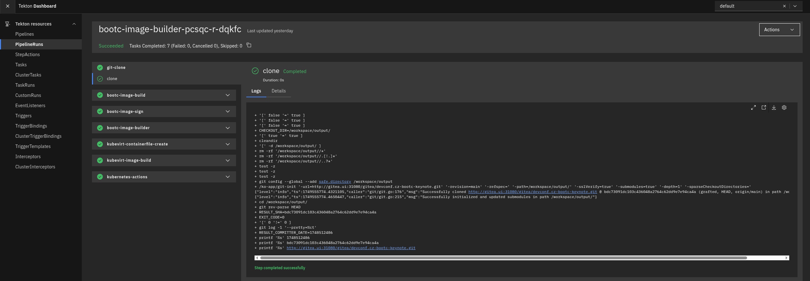
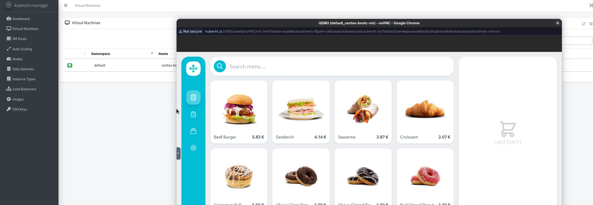

# devconf.cz-bootc-keynote

This repository contains the bits to replicate the demo for DevConf.cz 2025 Keynote!

## 🧰 KubeVirt + Tekton + Gitea Setup Script

This script automates the installation and configuration of:

- [KubeVirt](https://kubevirt.io/)
- [CDI (Containerized Data Importer)](https://github.com/kubevirt/containerized-data-importer)
- [Tekton Pipelines, Triggers, Dashboard, and Tasks](https://tekton.dev/)
- [FlightCtl](https://github.com/flightctl/flightctl)
- [Gitea](https://gitea.io/)
- Custom resource definitions and webhook setup

### 🛠️ Configurable Parameters

| Variable                  | Description                          | Default                          |
|--------------------------|--------------------------------------|----------------------------------|
| `FLIGHTCTL_VERSION`      | FlightCtl Helm chart version         | `0.7.2`                           |
| `FLIGHTCTL_BASE_DOMAIN`            | Base domain for flightcl configuration - Replace with your Ingress IP              | `192.168.200.165.nip.io`         |
| `FLIGHTCTL_API_PORT`               | NodePort for FlightCtl API service   | `32001`                          |
| `FLIGHTCTL_CLI_ARTIFACTS_PORT`     | NodePort for CLI artifacts service   | `32002`                          |
| `FLIGHTCTL_AGENT_PORT`             | NodePort for FlightCtl agent         | `32003`                          |
| `FLIGHTCTL_UI_PORT`                | NodePort for FlightCtl UI            | `32004`                          |
| `FLIGHTCTL_KEYCLOAK_PORT`          | NodePort for Keycloak service        | `32005`                          |
| `GITEA_HOST`             | Gitea ingress host                   | `gitea.ui`                       |
| `GITEA_USER` / `PASS`    | Gitea admin credentials              | `gitea` / `redhat123`            |
| `API_PORT`...`UI_PORT`   | NodePort ranges for FlightCtl        | `32001`–`32005`                  |
| `REPO_CLONE_URL`         | Git repo to import into Gitea        | `https://github.com/kubealex/devconf.cz-bootc-keynote`                |
| `REPO_NAME`              | Repo name in Gitea                   | `devconf.cz-bootc-keynote`       |

### 🧱 Prerequisites

Before running the script, ensure the following are in place:

- A running **Kubernetes cluster**
- [`kubectl`](https://kubernetes.io/docs/tasks/tools/) is installed and configured
- [`helm`](https://helm.sh/docs/intro/install/) is installed
- [`jq`](https://stedolan.github.io/jq/download/) is installed
- Internet access from the cluster (to fetch remote manifests and container images)
- Sufficient cluster resources (memory, CPU) for components like Gitea, Tekton, and KubeVirt

### 📦 What This Script Does

1. **KubeVirt Installation**
   - Installs latest stable release of KubeVirt and the KubeVirt Manager UI.

2. **CDI Installation**
   - Installs the latest version of the Containerized Data Importer.

3. **Tekton Installation**
   - Installs Pipelines, Dashboard, Git Clone Task, Triggers, and Interceptors.

4. **FlightCtl Installation**
   - Deploys `flightctl` via Helm with custom NodePort and domain configurations.

5. **Gitea Installation**
   - Installs `gitea` using Helm with ingress, admin user, and webhook config enabled.

6. **Custom Resource Deployment**
   - Applies local YAMLs: `lab-ingress.yml`, `tekton/tekton-tasks.yml`, `tekton/tekton-pipelines.yml`, `tekton/tekton-triggers.yml`.

7. **Gitea GitHub Repo Import**
   - Creates a Gitea token.
   - Imports the demo GitHub repo into Gitea.
   - Sets up a webhook to notify Tekton on repo events.

### 🚀 Usage

1. Customize the script’s variables to match your environment.
2. Make the script executable:
   ```bash
   chmod +x prepare-setup.sh
3. Run the script, if you are OK with the defaults.
   ```bash
   ./prepare-setup.sh

## The bundled application - Tailwind POS

Along with the resources needed to prepare the cluster, we provided a [Containerfile](./Containerfile) that embeds into the OS Image a [demo POS application](https://github.com/luisarizmendi/tailwind-pos) whose image has been built and is available on [Quay.io](http://quay.io/kubealex/tailwind-pos).

This application has been linked to the bootc lifecycle using the concept of [Logically Bound Images](https://bootc-dev.github.io/bootc/logically-bound-images.html) and it became integrating part of the final OS setup, started as a service upon system startup and available on port **8080** of the host.

Logically bound images allow updating the container images of the application using bootc, but without touching the underlying OS layers (when using *bootc upgrade* it will fetch the new image and doesn't require a host reboot).

## Flightctl configuration

Along with that, we also provide the configuration to enroll the device into [FlightCtl](https://github.com/flightctl/flightctl). To do this, download the [FlightCtl CLI](https://github.com/flightctl/flightctl/releases).

Retrieve the password from the setup:

```bash
FC_PASS=$(kubectl get secret/keycloak-demouser-secret -n $FC_NAMESPACE -o=jsonpath='{.data.password}' | base64 -d)
```

And use it to login:

```bash
flightctl login ${FC_API_URL} -u demouser -p ${FC_PASS}
```

Generate the agent config:

```bash
flightctl certificate request --signer=enrollment --expiration=365d --output=embedded > config.yaml
```

This configuration will be embedded into the final image to ensure the device can be enrolled into flightctl.

## Running the demo!

Now that everything is in place, review the content of the Tekton dedicated tasks in [the tekton folder](./tekton/README.md).

Head to the **Gitea** instance, login with the credentials you defined and go in the devconf.cz-bootc-keynote.

The webhook we configured will act upon *tag creation*, so we want to ensure that a new release is created with a relative tag.

Go in the **Releases** section of the repo and draft a new release. When choosing the name, add the suffix **qcow** to generate the QCOW2 image to use with KubeVirt.

Upon creation, the end-to-end pipeline will trigger, performing the following steps:

* **`bootc-image-build`**: Handles container image building and pushing with Podman.

* **`bootc-image-sign`**: Manages image signing using Cosign.

* **`bootc-image-builder`**: Performs the core image conversion.

* **`kubevirt-containerfile`**: Creates a special `Containerfile` to package QCOW2 images for KubeVirt ContainerDisks.

* **`kubernetes-actions`**: Generates a KubeVirt VM based on a template

If everything went smooth, you should see the following result:



Verify that the system booted up and that the POS application is available!


